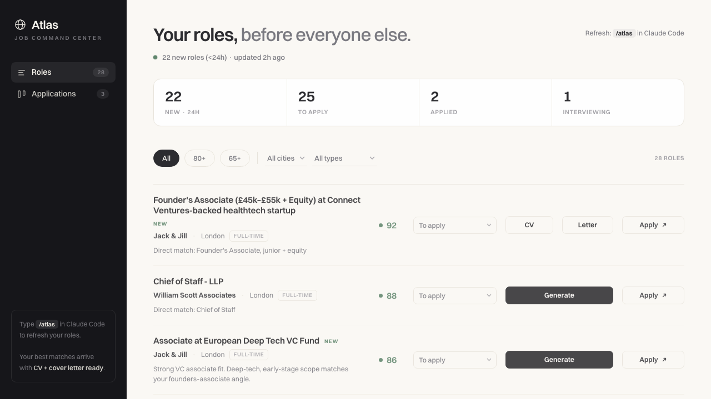

<div align="center">

# Atlas

### Your roles, before everyone else.

**A free job-hunt command center that runs on your own machine.**

Atlas finds fresh roles before the crowd, scores them against your profile, writes
your tailored CV and cover letter, and tracks every application — all powered by the
coding agent you already use. No subscription. No API keys. Your CV never leaves your laptop.

</div>

---

## How you use it

The entire manual is two lines.

```bash
git clone https://github.com/kamilassari-collab/atlas.git && cd atlas
```

Open the folder in Claude Code (or Cursor) and type **`/atlas`**.

That one command does everything:

> **fetch** fresh roles → **score** them for you → **prep** CVs + letters for your top matches → **open** your dashboard.

The first time, it asks you a few quick questions and for your CV. After that, just type
`/atlas` whenever you want fresh roles waiting. You live in the dashboard; you only talk
to the agent when you want something specific — *"tailor the Stripe one,"* *"I got an
interview at McKinsey."*

> **What you give Atlas (once):** nothing is uploaded to a server — Atlas just asks where
> your files are. Two things:
> - **Your CV.** A Word **`.docx`** is best (Atlas tailors it in place and keeps your exact
>   design); a PDF works too but you'll get a suggestions list instead.
> - **A cover-letter model** (optional but recommended) — your best past letter, or one
>   whose style you like. Atlas writes every cover letter in *that* tone and structure, so
>   they sound like you instead of like AI. No model? It writes a clean default and you can
>   add one later.
>
> Both stay on your machine.

## One honest requirement

Atlas runs *inside* a coding agent — **Claude Code or Cursor**. That agent is what does
the AI, for free, without sending your CV anywhere.

- **Already use one?** You're five minutes from your own command center.
- **Don't?** Install [Claude Code](https://claude.com/claude-code) first (two minutes). It's the only prerequisite.

If you'd rather never touch a coding agent, Atlas isn't for you yet — and that's fair.
It's built for people who already live in these tools.

## Why it's free, and why it's local instead of a website

That's the whole trick:

- **Your agent does the AI.** Scoring, CV tailoring, cover letters — all run on the
  Claude or Cursor subscription you already pay for. No bill lands on anyone.
- **Your home internet does the fetching.** LinkedIn serves fresh jobs to home
  connections but blocks cloud servers. Running locally is actually *better* for fresh
  roles — and impossible to host.
- **Your data stays yours.** Your CV and applications live in `data/`, gitignored,
  never uploaded.

A hosted version would get its IP blocked by LinkedIn and put an AI bill on someone.
Local-first isn't a limitation. It's the feature.

## The dashboard

<div align="center">



*A premium, quiet command center.*

</div>

A ledger of scored roles, a real funnel (to apply → applied → interviewing), and a
drag-and-drop kanban. Your top matches arrive with CV + cover letter already prepared.
Click to download, click to apply.

## What it will never do

- **Invent CV content.** It re-angles your *real* bullets to fit a role. It never adds a
  fact, number, company, or skill that isn't already on your CV.
- **Rebuild a PDF CV.** A DOCX gets an in-place bullet swap with your design untouched; a
  PDF gets a suggestions list you apply yourself.
- **Call a paid API.** Your agent is the intelligence. That is what keeps it free.
- **Send your data anywhere.** Everything stays on your machine.
- **Pretend a fetch worked** when it returned nothing. It tells you the truth.

## Under the hood

| Piece | How |
|-------|-----|
| Scrapers | JobSpy (LinkedIn + Indeed + Google + more) → LinkedIn guest endpoint → free job APIs. A fallback chain that never silently returns nothing. |
| Storage | SQLite, stdlib, no ORM — entirely local |
| CV | `python-docx` in-place swap, converted to PDF with your design preserved |
| Letters | `reportlab` PDF, rendered locally |
| Dashboard | One stdlib HTTP server and one HTML file. No build step. |
| Runtime | [`uv`](https://docs.astral.sh/uv/) pins the right Python so you never debug a version |

## Works with any agent

`AGENTS.md` is the cross-agent operating guide — Claude Code, Codex, Cursor, and
antigravity all read it. `CLAUDE.md` just imports it. One kit, any agent.

## License

MIT. Use it, fork it, share it with your whole class.

---

<div align="center">
<sub>Built by a student who got tired of applying late. Free for everyone doing the same.</sub>
</div>
